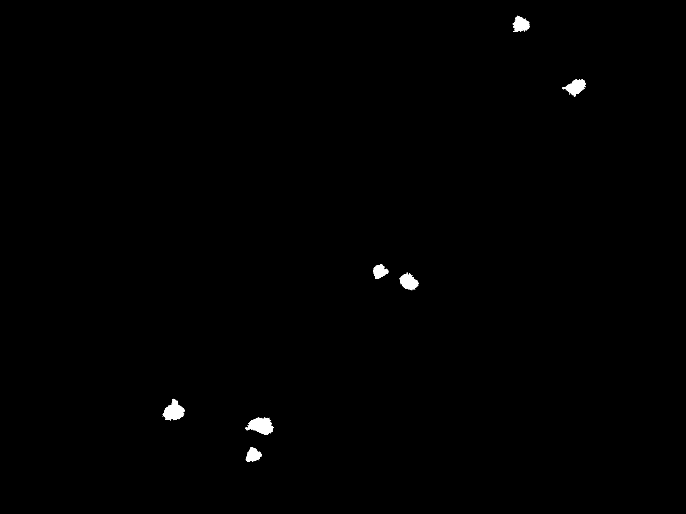
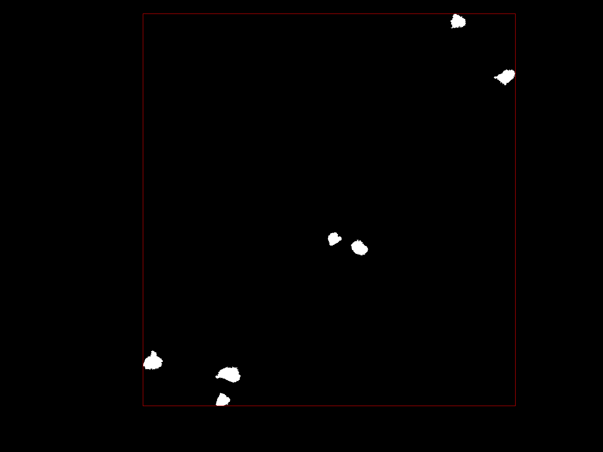
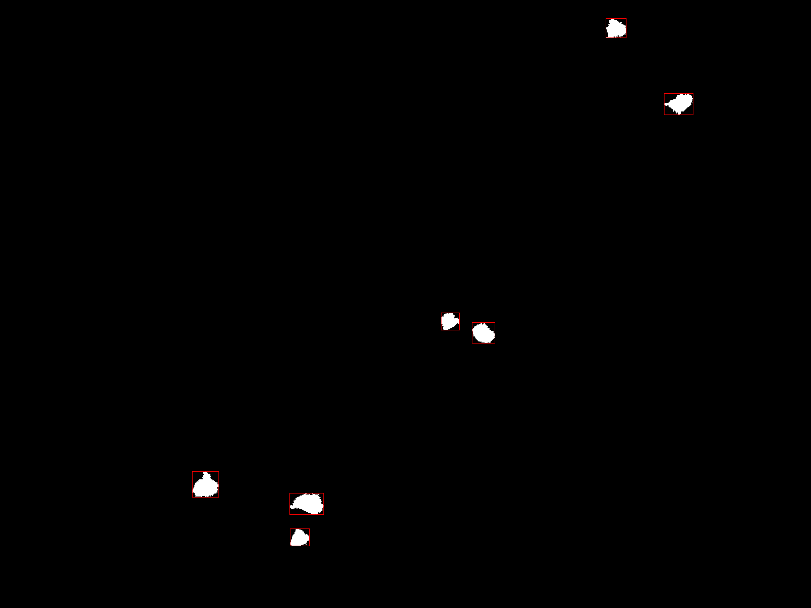

# Binary mask to Bounding Boxes
This is a simple Python implementation of a method that takes in input a binary segmentation mask (i.e., with only 1, True, and 0, False, values) and it returns the list of multiple bounding boxes, one for each instance present in the mask.

> Why is this code useful?

Nice question! 

The most common case involving the creation of multiple bounding boxes is that associated with the presence of several classes, where each class marked with a pixel of different value, thus using a multi-class segmentation mask. But what if we have a binary mask? What if we have *n* different instances of the same object in the same segmentation mask? 

Well, unfortunately most, if not all, libraries in Python (ex.: torchvision) perform bounding box calculations of binary mask using built-in functions that **do not consider** that more than one instance of a certain class could be present in the segmentation mask.

As example, let's consider the following binary image representing some particles:



Suppose we want to generate the bounding boxes for these particles using ```torchvision.ops.masks_to_boxes()```, this is the result:



You can see right away what the problem with the method is: it calculates the sides of the bounding boxes by taking the coordinates of the 4 farthest points to the right, left, top, and bottom where a pixel of value 1 is located, creating one large bounding box that encloses all the pixels labeled with 1 (i.e., representing the same class).
Clearly the problem is that although the pixel instances are all labeled with the same value, and thus belong to the same class, the instances are different and we are interested in having a different bounding box for each separate instance. 

With my simple code the new bounding boxes produced are:



> Just this?

Emm... yes (?), as far as my research revealed all python libraries used in computer vision do not consider this scenario, considering only the multiclass one or alternatively needing to have provided tensors/arrays that have shape equal to *[n_instances, h, w]*. 